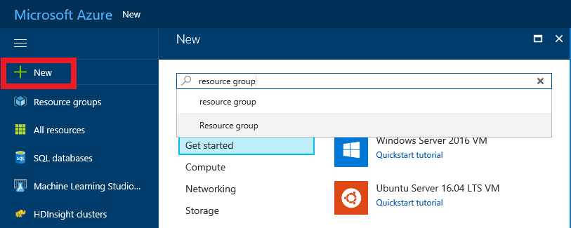
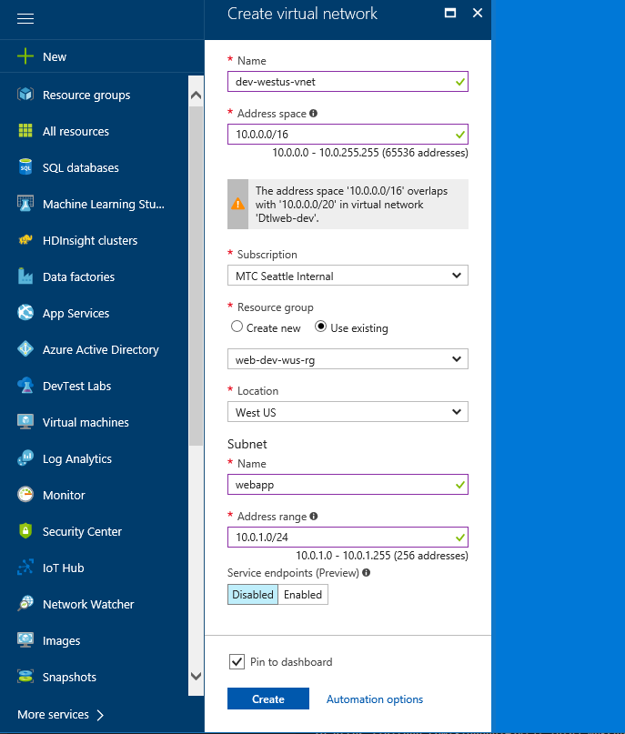

# Create Resource Group

> *[NOTE]*: If you already have a resource group for the lab, you can skip this step. But, note that you must have *owner* permission of the resource group for hands on lab.

1. Create resource group

    Click '+ new' and search 'Resource group'.

    

    Use following name and location for the lab

    |Name|Subscription|Location|
    |---|---|---|
    |web-dev-wus-rg|*yoursubscription*|*West US*|

> *[NOTE]*: Please check 'Pin to Dashboard' so you can access the resource easy.

# Create Virtaul Network

## Architecture

Create first resource in the resource group.

1. Create Virtual network

    Click '+ new' and search 'Virtual Network'.

    Leave deployment model as 'Resource Manager'.

    

    Use following name and location for the lab.

    |Name|Address Space|Subscription|Resource Group|Location|Subnet Name|Subnet range|
    |---|---|---|---|---|---|---|
    |dev-westus-vnet|10.0.0.0/16|*yoursubscription*|*yourresourcegroup*|West US|webapp|10.0.1.0/24 

    It'll be look like following.

    

    Click 'Create'.

---

[Next Lab 2.>>](https://github.com/xlegend1024/az-infra-wrkshp-101/tree/master/3.%20Hands%20on%20Labs/3.2.%20Manage%20NSG)