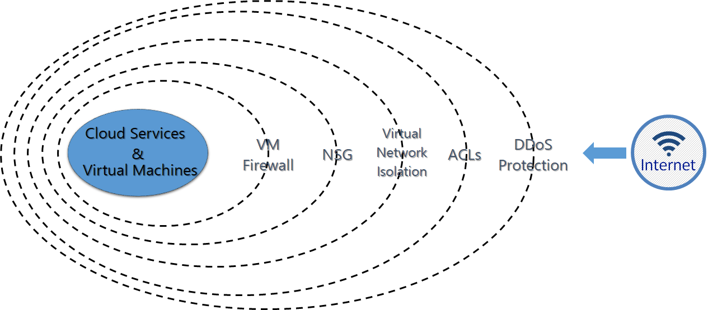
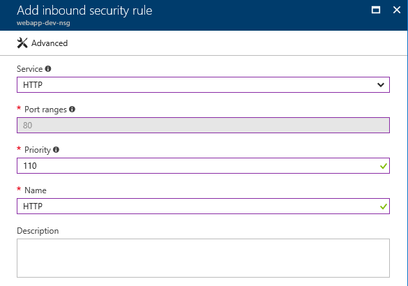
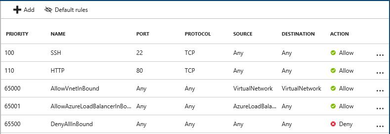
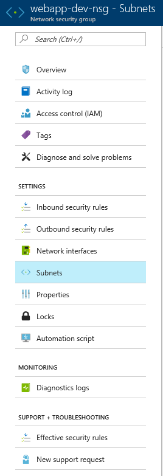

# Create Network Security Group

You can control network traffic. Following figure shows how network traffic flows. For example, if a traffic flow into a Virtual Machie, the traffic will go thru Subnet level NSG and then NIC level NSG. And an out bound traffic will go thru NIC level NSG and then subnet level NSG.

1. Create Network Security Group

    Click '+ New' and search 'Network Security Group'.
    Use following names to create new NSG for this lab.

    |Name|Subscription|Resource Group|Location|
    |---|---|---|---|
    |webapp-dev-nsg|*yoursubscription*|*yourresourcegroup*|West US| 

1. Add Inbound Security Rules

    Adding rules are somewhat similar to firewall rule menagement. Allow TCP 22 and TCP 80 port for dev and test environment.

    1. Allow inbound TCP 22 SSH port

    Click 'Inbound security rules' at the Settings. Click *Add*.
    And select *SSH* from 'Service' combo box.
    Leave *Priority* as default which is 100.

    > If you don't see 'Service' combo box, please click *Basic* to change basic mode.

    

    2. Allow inbound TCP 80 HTTP port

    Click 'Inbound security rules' from Settings. Click *Add*.
    And select *HTTP* from 'Service' combo box. 
    This time modify *Priority* as 110. Because the Priority can't be overlaped within a NSG.

    > If you don't see 'Service' combo box, please click *Basic* to change basic mode.

    

    3. Check current status NSG rules.

    

1. Apply the rule to Subnet

    1. Click 'Subnets' at the Setting.

    

    2. Click *+ Associate* then you will see additional steps.

    3. Click *1. Virtual Netowkr* and select *dev-westus-vnet*.

    

    4. Click *2. subnet* and select *webapp*.

    

    4. Click *Okay*.

    5. You will see the NSG is associated with subnet.

    

---

[Next Lab 3.>>](https://github.com/xlegend1024/az-infra-wrkshp-101/tree/master/3.%20Hands%20on%20Labs/3.3.%20Create%20custom%20VM%20Image)