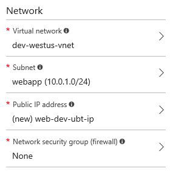
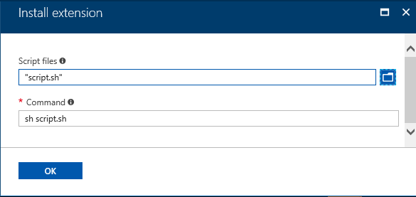
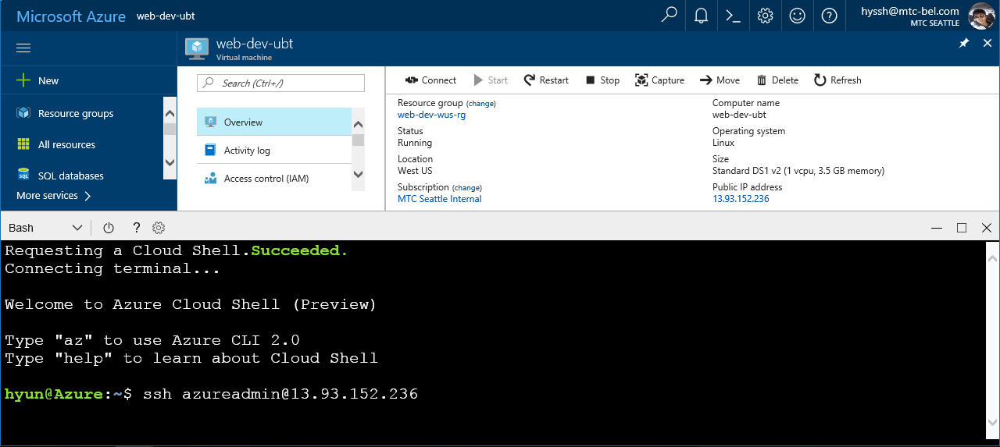

# Create custom VM image
Create linux Virtual Machie from Azure Marketplace. And create web app VM image for production environment.

## Architecture 


### Create Ubuntu VM
1. Click *+New* and search 'ubuntu'.

    

2. From the search result, select 'Ubuntu Server 16.04 LTS'.

    

3. Click *Create*.

    


4. Please use below table to fillout the form.

    |Name|VM Disk Type|User Name|Authentication Type|Password|Subscription|Resource Group|Location|
    |---|---|---|---|---|---|---|---|
    |web-dev-ubt|SSD|azureadmin|Password|P@ssword1234|*yoursubscription*|*yourresourcegroup*|West US|


5. Choose VM Size

    


6. Settings for VM
    * High Availability 
        - Keep the default options.

            |Availability Zone|Availability Set|
            |---|---|
            |None|None|

    * Storage
        - Keep the default option. 
    
            |Use Managed Disks|
            |---|
            |Yes|
        
    * Network
        - Choose development virtual network and subnet.
        
        


    * Extensions
        - Add Extension
        
        

        - Download the sample script from [here](https://raw.githubusercontent.com/xlegend1024/az-infra-wrkshp-101/master/9.%20Resources/script.sh). 

        - Upload the script.
        
        

    * Auto-Shutdown
        - Leave is as default, 'Off'.
    * Monitoring
        - Disable both 'Boot diagnostics' and 'Guest OS diagnostics'.

7. Review summary and click *Create* to provision a VM. (It'll takes around 5 minutes.)
    * VM creation includes:
        * Create VM
        * Update OS
        * Install Apache
        * Download and Install sample Web app
    * When the provisioning is done you will see detail information like following.
        
        
        > let's note the ip address of the VM for later use.

8. Deprovision<br>
Deprovisioning will attempt to generalize the image. Attempt to clean the system and make it suitable for re-provisioning. </br>
This operation deleted the following:
    * All SSH host keys (if Provisioning.RegenerateSshHostKeyPair is 'y' in the configuration file)
    * Nameserver configuration in /etc/resolv.conf
    * Root password from /etc/shadow (if Provisioning.DeleteRootPassword is 'y' in the configuration file)
    * Cached DHCP client leases
    * Resets host name to localhost.localdomain

    8.1. Access VM
    Launch [Cloud Shell](https://docs.microsoft.com/en-us/azure/cloud-shell/quickstart) by clicking icon, , on top of azure portal.</br>
    And in the Cloud Shell run ssh command to access the VM. 
    

    8.2. Run deprovisoning command and proceed the command by typing 'y'.
    ```
    sudo waagent -deprovision+user
    ```

    

1. Shutdown VM

Click  and stop the VM.

## Capture VM as customized image

1. Capture VM

When VM is stoped click .
Change image name like following.

    |Name|Resource Group|delete VM|
    |:---:|---|---|
    |web-ver1-image|*yourresourcegroup*|yes|

    .

## Architecture 
When captruing is done, your vm in no longer exisit. So your current architecture will look like following.


<hr>

[Next Lab 4.>>](https://github.com/xlegend1024/az-infra-wrkshp-101/tree/master/3.%20Hands%20on%20Labs/3.4.%20Create%20VM%20Portal)